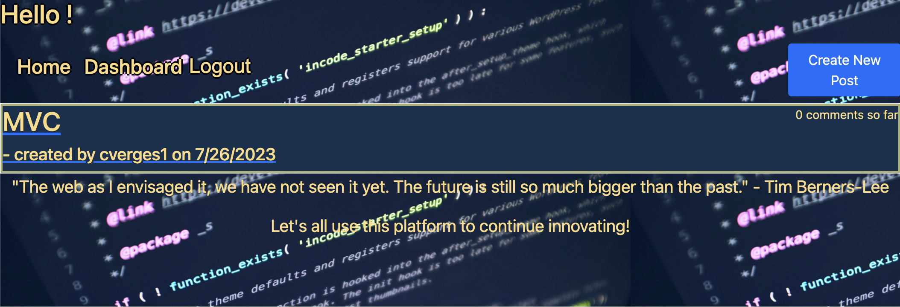

  # Web Development Tech Blog
  ## Licensing: MIT 
  ## Description
  This project is a full stack application of a blog meant for developers.  The Web Development Tech Blog was created as a place for developers to post their thoughts and ideas in an effort to continue innovation.  This project was a great challenge in combing all the skills I have learned to this point. After completing this project I feel much more confident in my ability to design any full stack web app.

Deployed Application: https://web-dev-tech-blog-a65171408830.herokuapp.com/

  ## Table of Contents
  
  -[Installation](#installation)
  -[Usage](#usage)
  -[Credits](#credits)
  -[License](#license)  

  ## Installation
  
  To install this project yourself, visit https://github.com/cverges1/Tech-Blog-MVC and download the code. You will need to create a .env file with a DB_NAME set to web_dev_blog and your relevant mysql information. You will then need to open the terminal at the root of the file structure and run npm i. Last you will need to run npm run seed.
  
  ## Usage
  
  To use the application simply click on posts to see them in more detail. If you would like to comment or make a post yourself, navigate to the sign up button and enter your information. Now you will be able to comment, post and log back in whenever you would like. If you would like to update or delete one of your posts, navigate to the dashboard for those options.
  
  ## Credits
  
  - Collaborators: N/A
  - Third Party Assets: node.js, express.js, mysql, sequilize, bcrypt, dotenv, nodemon, bootstrap, html, css, and javascript

  ## Questions
  To contact me with additional questions:
  - Github: cverges1
  - Email: vergeschris@gmail.com
  